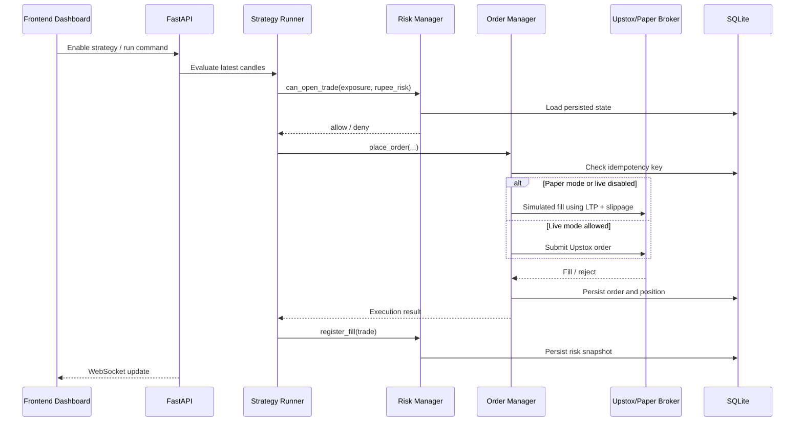
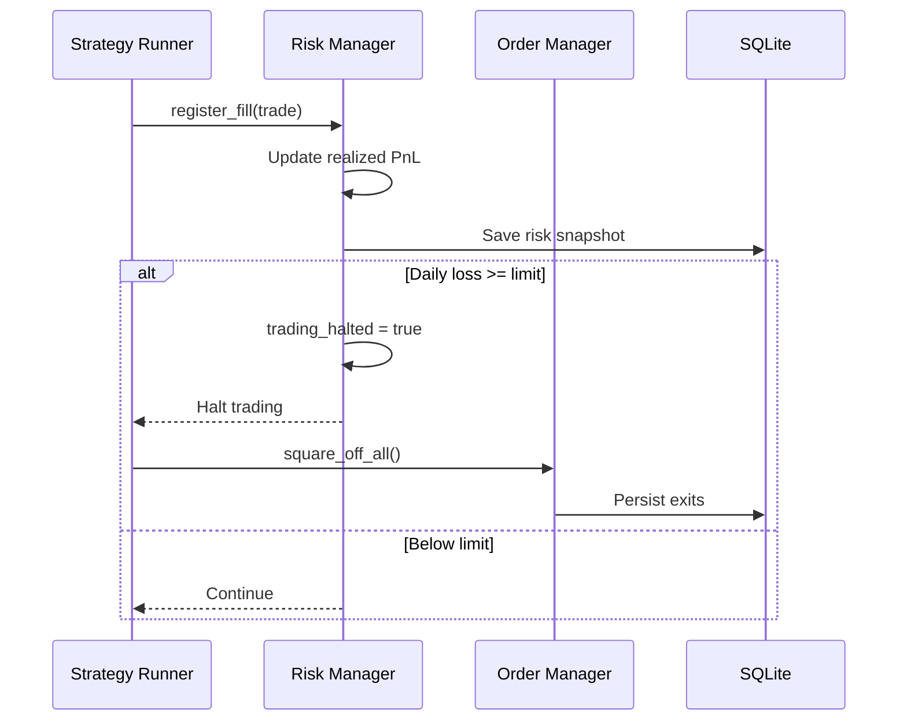
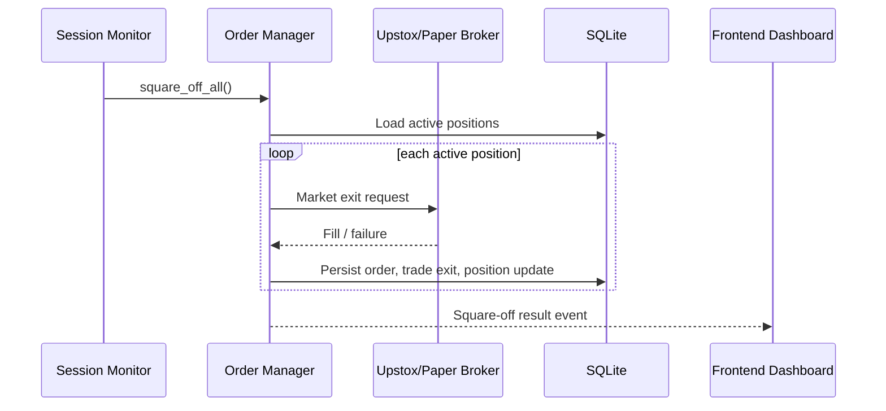

# Architecture

## Overview

The platform is split into:

- FastAPI backend for orchestration, WebSocket streaming, order control, and reporting
- SQLite for cache, trades, orders, and risk recovery
- Strategy modules with a shared `generate_signals(df, config)` API
- A paper-first execution path guarded by `DISABLE_LIVE_TRADING`
- A React dashboard that consumes REST and WebSocket updates

## Order Flow

## Risk Enforcement

## Square-Off Flow

## Assumptions

- Market hours use NSE cash-session timing with auto square-off at `15:14 IST` by default.
- `NIFTY` and `BANKNIFTY` lot sizes can change over time, so the code first looks for broker or chain metadata and then falls back to a local mapping.
- Some remote endpoints differ by broker account tier or API version; where exact live behavior is uncertain, the code defaults to paper mode and includes clear TODOs.
